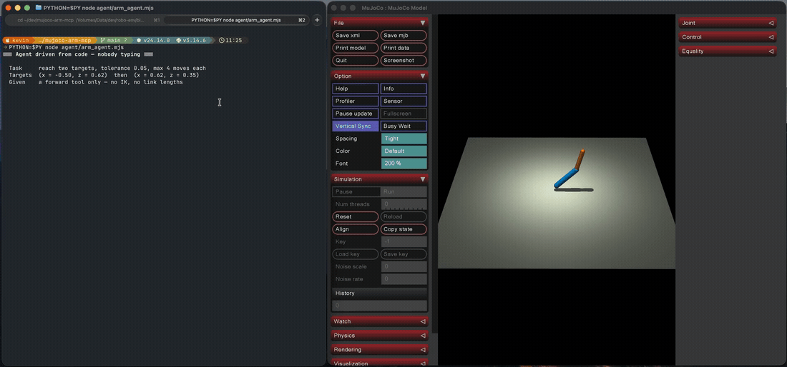
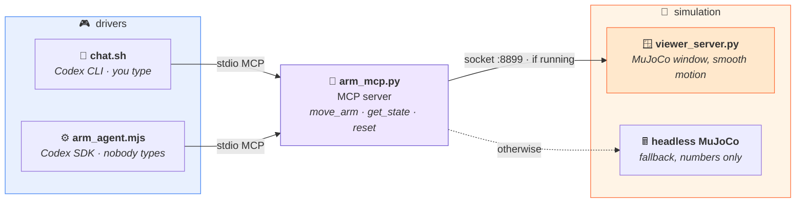
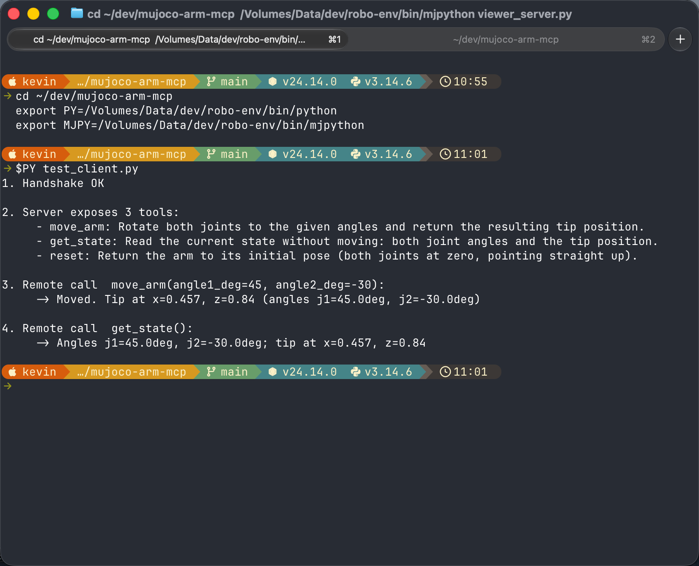

<div align="center">

# 🦾 mujoco-arm-mcp

### The agent is given no inverse kinematics — only a forward tool. It has to work the answer out.

A two-joint arm in [MuJoCo](https://mujoco.org/) behind an MCP server, so an LLM agent can drive it —
and, given a target coordinate, must find the joint angles itself.

<br/>

[](https://www.python.org/)
[](https://mujoco.org/)
[](https://modelcontextprotocol.io/)
[](LICENSE)

<br/>



<sub>Two targets, no inverse kinematics, six tool calls — driven from the SDK with nobody typing.</sub>

</div>

---

## The idea

Giving an agent a robot arm is easy. The interesting question is **what you leave out**.

This server exposes one way to act — set two joint angles — and one way to perceive — read where the
tip ended up. There is no `move_to(x, z)`, no inverse-kinematics solver anywhere in the repository,
and the link lengths are never disclosed. So *"put the tip at x ≈ −0.50, z ≈ 0.62"* has no lookup
answer.

What the agent does with that is more interesting than groping around. In the run above it spends
its second call on a deliberately orthogonal pose — `j1=0, j2=90` — which separates the two links
along different axes and exposes both lengths in a single reading, then solves the geometry it just
measured. **Six calls for two targets, and only one of them is an experiment.**

---

## Architecture



Two processes, not one: macOS requires the GUI to own the main thread, so the viewer cannot live
inside the MCP server. They talk over a local socket, and the server works with or without it.

---

## The tools

| Tool | Signature | Returns |
|:--|:--|:--|
| `move_arm` | `(angle1_deg, angle2_deg)` | tip position `(x, z)` after the move |
| `get_state` | `()` | current joint angles **and** tip position, without moving |
| `reset` | `()` | returns to the zero pose |

**Leaving the solver out is the design.** The tool surface decides whether the agent is doing the
work or just relaying arguments — a `move_to(x, z)` tool would make every run one call long and show
nothing.

---

<details>
<summary><b>Running it</b></summary>

<br/>

```bash
python3 -m venv .venv && source .venv/bin/activate
pip install -r requirements.txt

mjpython viewer_server.py                  # the live window (macOS needs mjpython for the GUI)
python test_client.py                      # protocol check: handshake, list tools, remote call
./chat.sh                                  # Codex CLI, interactive
npm install && node agent/arm_agent.mjs    # Codex SDK — the run in the GIF
mjpython replay_viewer.py                  # replay the last run from trajectory.log
```

`PYTHON=./.venv/bin/python` overrides the interpreter passed to the agent. The MCP server is
normally launched *by* the agent over stdio; running `arm_mcp.py` by hand just leaves it waiting on
stdin.

Step by step, including how the GIF was produced, is in
[`docs/running-the-demo.md`](docs/running-the-demo.md).

</details>

<details>
<summary><b>The recorded run, in full</b></summary>

<br/>

```
=== Agent driven from code — nobody typing ===

  Task     reach two targets, tolerance 0.05, max 4 moves each
  Targets  (x = -0.50, z = 0.62)  then  (x = 0.62, z = 0.35)
  Given    a forward tool only — no IK, no link lengths

[agent] I'll probe the arm with decisive poses, infer only from the returned
        tip positions, and stay within the four-move limit per target.

   1  get_state
   2  move_arm   j1=    0.0   j2=   90.0

[agent] The probe exposed the two link contributions directly: 0.60 and 0.40.
        I'm using those observations for an exact large correction.

   3  move_arm   j1=  -68.1   j2=   76.2
   4  move_arm   j1=  -76.1   j2=   74.0

[agent] First target met.

  --  reset      ------- target 1 done, swinging back -------
   6  move_arm   j1=   31.5   j2=   84.7

[agent] Second target met. I found them by probing one orthogonal pose,
        inferring both link lengths and the base offset, then solving the
        observed geometry.
```

And the protocol-level check, `python test_client.py`:



</details>

<details>
<summary><b>Design notes</b></summary>

<br/>

**Degrade, don't fail.** The server tries the viewer socket with a one-second timeout and falls back
to its own MuJoCo instance if nothing answers. The agent never sees the difference, so the window is
a debugging convenience rather than a dependency.

**Frame the socket messages.** Commands are newline-terminated JSON and the reader keeps reading
until it sees the newline. TCP does not preserve message boundaries, and "one `recv` returns one
message" is a bug that only shows up under load.

**One definition of the robot.** The model XML, the forward kinematics and the socket helpers all
live in `arm_common.py`. The XML was duplicated in three files before that; the moment it needed to
change, that arrangement stopped working.

**Interpolate in the viewer, not in the protocol.** The server sends a target; the viewer walks 8%
of the remaining distance per frame. Motion looks continuous without any command being about motion.

</details>

<details>
<summary><b>Files</b></summary>

<br/>

| File | Role |
|:--|:--|
| `arm_common.py` | model XML, analytic forward kinematics, socket helpers — the single definition |
| `arm_mcp.py` | the MCP server: three tools, viewer-or-headless routing, trajectory logging |
| `viewer_server.py` | the MuJoCo window; listens on `:8899` and eases toward the target pose |
| `replay_viewer.py` | replays `trajectory.log` as one continuous motion |
| `test_client.py` | protocol-level client: handshake, list tools, remote call |
| `chat.sh` | one command to start a Codex CLI session with the arm attached |
| `agent/arm_agent.mjs` | the same thing from the Codex SDK, streaming each tool call |

</details>

---

## Scope

Deliberately small: two joints, planar motion, no dynamics, no collisions, no gripper. It exists to
make one thing easy to look at — an agent closing a loop through tools — not to be a robotics
framework.

<div align="center">
<br/>

MIT © [kevinave](https://github.com/kevinave)

</div>
