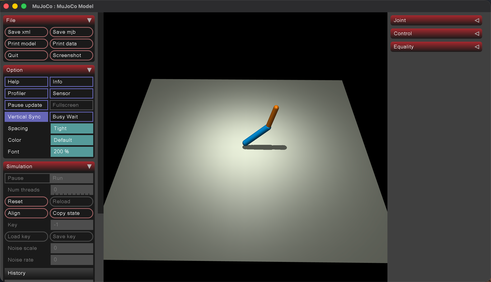
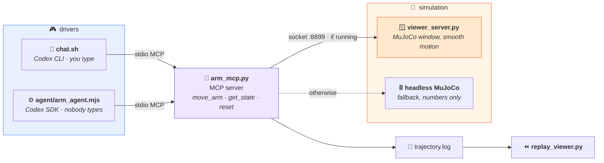

<div align="center">

# 🦾 mujoco-arm-mcp

### The agent is given no inverse kinematics — only a forward tool. It has to search for the answer.

A minimal MCP server that puts a two-joint arm in [MuJoCo](https://mujoco.org/) behind three tools,
so an LLM agent can drive it — and, given a target coordinate, must find the joint angles itself by
trying, reading the result, and correcting.

<br/>

[](https://www.python.org/)
[](https://mujoco.org/)
[](https://modelcontextprotocol.io/)
[](LICENSE)

<br/>



</div>

<br/>

|  | |
|---|---|
| 🎯 | **Closed-loop by necessity** — no IK tool, so reaching a coordinate is a search the agent runs itself |
| 🪟 | **Watch it move** — a live MuJoCo window follows the agent's commands, smoothly, in real time |
| 🔌 | **Two drivers** — the same server from a Codex CLI chat, or driven programmatically from the SDK |
| 🧩 | **Degrades instead of failing** — no viewer running? the server falls back to headless computation |
| ⏪ | **Replay** — every command is logged, so a finished run can be played back as one continuous motion |

---

## 💡 The idea

Giving an agent a robot arm is easy. The interesting question is **what you leave out**.

This server exposes exactly one way to act — set two joint angles — and one way to perceive — read
where the tip ended up. There is no `move_to(x, z)`, and no inverse-kinematics solver anywhere in
the repository. So a task like *"put the tip at x ≈ −0.4, z ≈ 0.7"* has no lookup answer. The agent
has to guess a pose, read the resulting coordinate, work out which way it was wrong, and try again
until it is inside tolerance.

That makes the reasoning visible. Every move is a tool call you can watch, in the terminal and in
the viewer window at the same time — which is the whole reason the project exists: **a small,
honest surface for looking at how an agent behaves when the answer is not in the tool.**

What it actually does there is more interesting than groping around. In the run recorded below, the
agent spends its second call on a deliberately orthogonal pose — `j1=0, j2=90` — which separates
the two links along different axes and exposes both lengths in a single reading. It then solves the
geometry it just measured. Six calls for two targets, and only one of them is an experiment.

---

## 🏗️ Architecture



Two processes, not one: macOS requires the GUI to own the main thread, so the viewer cannot live
inside the MCP server. They talk over a local socket, and the server works with or without it.

---

## 🧰 The tools

| Tool | Signature | Returns |
|:--|:--|:--|
| `move_arm` | `(angle1_deg, angle2_deg)` | tip position `(x, z)` after the move |
| `get_state` | `()` | current joint angles **and** tip position, without moving |
| `reset` | `()` | returns to the zero pose, tip position |

Angles are degrees: `angle1` is the upper arm from vertical, `angle2` the forearm relative to the
upper arm. Forward kinematics is solved analytically in `arm_common.py` and agrees with MuJoCo's own
numbers — the viewer path and the headless path return the same coordinates.

---

## ▶️ Driving it

### From a chat — `./chat.sh`

Starts a Codex session with the arm attached, and you talk to it:

```bash
./chat.sh "Put the tip at x=0.3, z=0.7"
```

### From code — `node agent/arm_agent.mjs`

The same server, driven by the SDK with nobody typing. It streams every tool call as it happens:

```
=== Agent driven from code — nobody typing ===

  Task     reach two targets, tolerance 0.05, max 4 moves each
  Targets  (x = -0.50, z = 0.62)  then  (x = 0.62, z = 0.35)
  Given    a forward tool only — no IK, no link lengths

[agent] I'll probe the arm with decisive poses, infer only from the returned
        tip positions, and stay within the four-move limit per target.

   1  get_state
   2  move_arm   j1=    0.0   j2=   90.0

[agent] The probe exposed the two link contributions directly: 0.60 and 0.40.
        I'm using those observations for an exact large correction.

   3  move_arm   j1=  -68.1   j2=   76.2
   4  move_arm   j1=  -76.1   j2=   74.0

[agent] First target met.

  --  reset      ------- target 1 done, swinging back -------
   6  move_arm   j1=   31.5   j2=   84.7

[agent] Second target met. I found them by probing one orthogonal pose,
        inferring both link lengths and the base offset, then solving the
        observed geometry.
```

<div align="center">

</div>

### Checking it is a real MCP server — `python test_client.py`

Connects over stdio as a protocol client: handshake, list tools, call one remotely.

<div align="center">

</div>

### Replaying a run — `mjpython replay_viewer.py`

Reads `trajectory.log` and plays the agent's search back as one smooth motion, pausing at each pose
it tried.

---

## 📐 Design notes

**Leave the solver out.** The tool surface is what decides whether the agent is doing the work or
just relaying arguments. A `move_to(x, z)` tool would have made every run one call long and shown
nothing.

**Degrade, don't fail.** `arm_mcp.py` tries the viewer socket with a one-second timeout, and falls
back to its own MuJoCo instance if nothing answers. The agent never sees the difference — it gets
the same coordinates either way — so the window is a debugging convenience, not a dependency.

**Frame the socket messages.** Commands are newline-terminated JSON, and the reader keeps reading
until it sees the newline. TCP does not preserve message boundaries, and "one `recv` returns one
message" is a bug that only shows up under load.

**One definition of the robot.** The model XML, the forward kinematics and the socket helpers all
live in `arm_common.py` and are imported by everything else. The XML was duplicated in three files
before that; the moment it needed to change, that arrangement stopped working.

**Interpolate in the viewer, not in the protocol.** The server sends a target; the viewer walks 8%
of the remaining distance per frame. Motion looks continuous without any command being about motion.

---

## 🚀 Setup

<details>
<summary><b>Install and run</b></summary>

<br/>

```bash
git clone https://github.com/kevinave/mujoco-arm-mcp.git
cd mujoco-arm-mcp

python3 -m venv .venv && source .venv/bin/activate
pip install -r requirements.txt

# optional: the live window (macOS needs mjpython for the GUI)
mjpython viewer_server.py

# in another terminal — protocol check
python test_client.py

# or drive it with an agent
./chat.sh                       # Codex CLI, interactive
npm install && node agent/arm_agent.mjs   # Codex SDK, programmatic
```

`PYTHON=./.venv/bin/python` overrides the interpreter passed to the agent, for both drivers.

Step-by-step instructions for all three, including how the screenshots above were produced, are in
[`docs/running-the-demo.md`](docs/running-the-demo.md).

The MCP server is normally launched *by* the agent over stdio — running `python arm_mcp.py` by hand
just leaves it waiting on stdin.

</details>

<details>
<summary><b>Files</b></summary>

<br/>

| File | Role |
|:--|:--|
| `arm_common.py` | model XML, analytic forward kinematics, newline-framed JSON helpers — the single definition |
| `arm_mcp.py` | the MCP server: three tools, viewer-or-headless routing, trajectory logging |
| `viewer_server.py` | the MuJoCo window; listens on `:8899` and eases toward the target pose |
| `replay_viewer.py` | replays `trajectory.log` as one continuous motion |
| `test_client.py` | protocol-level client: handshake, list tools, remote call |
| `chat.sh` | one command to start a Codex CLI session with the arm attached |
| `agent/arm_agent.mjs` | the same thing from the Codex SDK, streaming each tool call |

</details>

---

## 📋 Scope

A deliberately small experiment: two joints, planar motion, no dynamics, no collisions, no gripper.
It exists to make one thing easy to look at — an agent closing a loop through tools — not to be a
robotics framework.

---

<div align="center">

MIT © [kevinave](https://github.com/kevinave)

</div>
